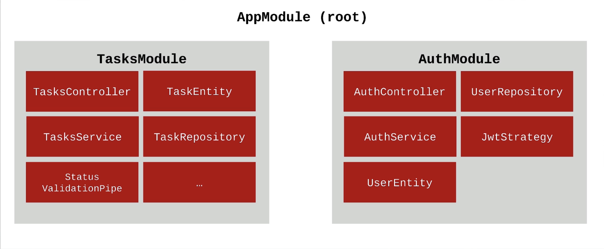

# Project 1: Task Management

### Application Structure

### Backend and Architecture

- Production ready REST APIs
- CRUD operations
- Error handling
- Data Transfer Objects (DTO)
- System Modularity
- Backend development best practices
- Configuration management
- Logging
- Security practices

### Persistence

- Connecting application to databse
- Working with relational database
- Using TypeORM
- Wiring simple and complex queries using `QueryBuilder`
- Performance when working with database

### Authorization and Authentication

- Sign up / Sign in
- Protected resources
- Ownership of tasks by user
- JSON Web Token (JWT)
- Password hashing, salt and properly storing password

### Deployment

- Polish the application for production use
- Deploy NestJS apps to AWS
- Deploy frontend applications to Amazon S3
- Wiring up the frontend and backend
